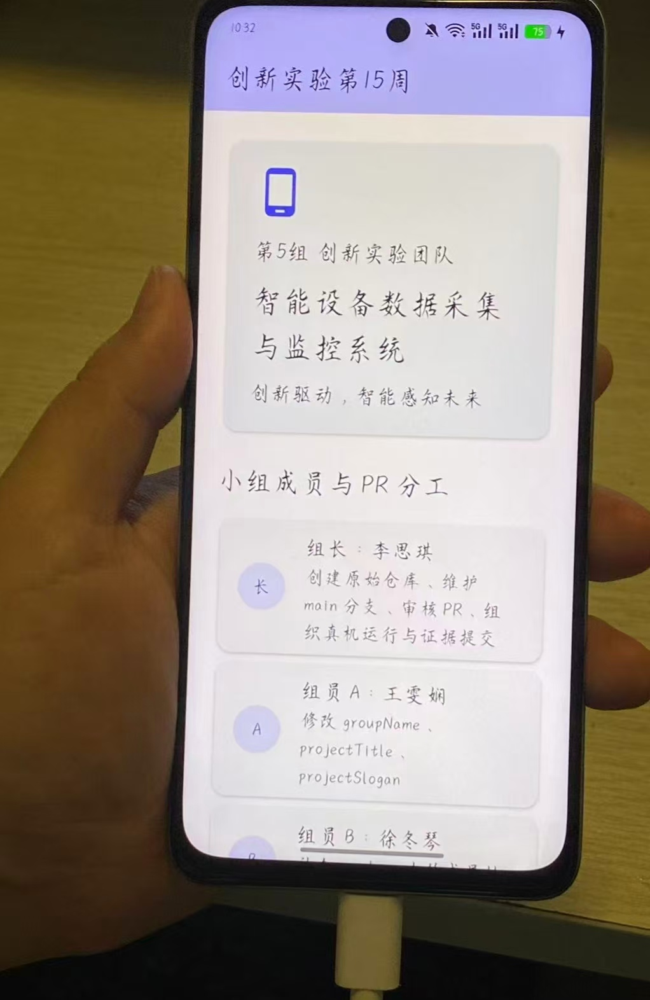
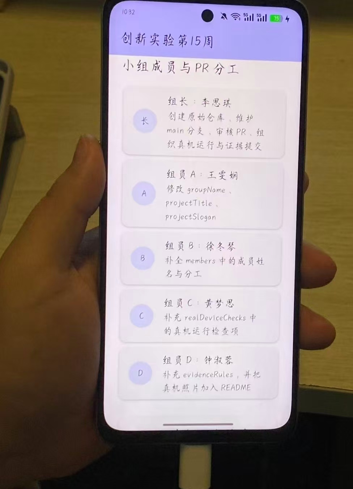

# innovation-week15-team5-device

## 真机照片要求

请把照片放到：

```text
images/android-real-device.jpg
```

并在本 README 中引用：

```markdown

```

合格照片必须满足：

- 真实 Android 手机正在运行本小组 Flutter 应用；
- 不能是 Web 截图；
- 不能是 Android 模拟器截图；
- 不能用手机本机截图代替；
- 必须由第二部手机拍摄；
- 照片中能看到手持手机；
- 不包含聊天记录、手机号、定位等隐私信息。

## 证据规则

1. 证据照片必须由第二部手机拍摄，不能用本机截图代替
2. 照片中要看到手持真实 Android 手机和本应用页面
3. README 中要包含 GitHub 协作说明、PR 合并记录和真机照片
4. 提交前检查照片不包含私人聊天、手机号、定位等隐私信息
5. 真机照片需包含应用运行界面和成员信息展示
6. 确保照片清晰度足够，能看清应用内容

## 本组真机运行照片

提交照片后，下面应显示本组运行效果：





如果图片暂时无法显示，请检查图片文件是否已提交。
